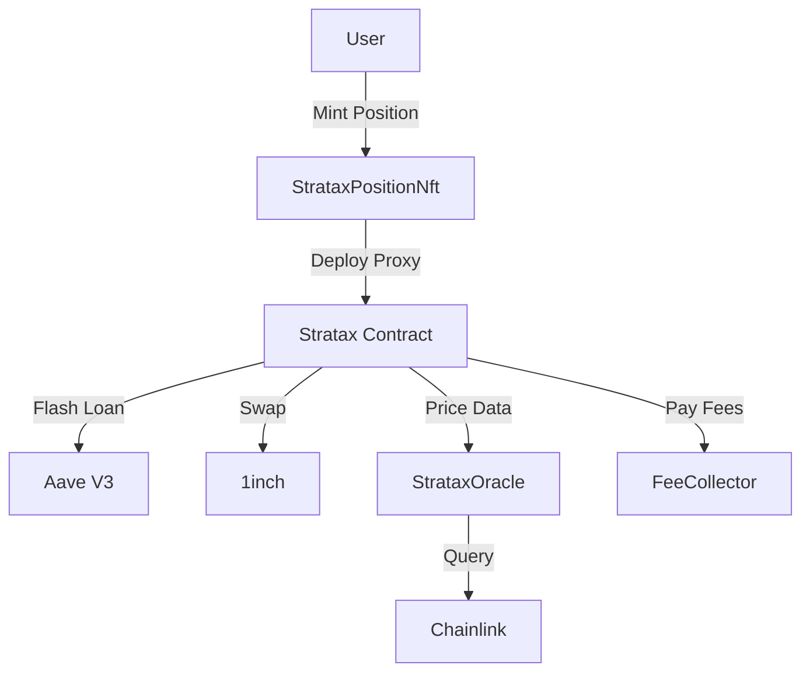

# System Overview

Stratax is a leveraged position protocol built on Ethereum that enables users to create leveraged long or short positions on crypto assets. The protocol follows a beacon proxy pattern where each position is an individual upgradeable contract represented by an NFT.

## Core Components

### 1. StrataxPositionNft

The factory contract that:

- Mints NFTs representing positions
- Deploys individual Stratax contracts as beacon proxies
- Manages the beacon for upgrades
- Tracks all positions globally

### 2. Stratax

The core position contract that:

- Manages a single leveraged position
- Interacts with Aave V3 for lending
- Executes swaps via 1inch
- Handles flash loans for capital efficiency
- Provides position management functions

### 3. StrataxOracle

Price feed aggregator that:

- Fetches prices from Chainlink oracles
- Provides standardized 8-decimal price format
- Supports multiple assets

### 4. FeeCollector

Fee management contract that:

- Collects protocol fees
- Allows fee withdrawal by admin
- Configurable fee rates

### 5. StrataxCalculations Library

Pure calculation functions for:

- Leverage calculations
- Position sizing
- Fee calculations
- LTV computations

## Design Principles

### Beacon Proxy Pattern

Each position uses the beacon proxy pattern for upgradeability:

- **Beacon**: Holds the implementation address
- **Proxy**: Minimal forwarding contract per position
- **Implementation**: Shared Stratax logic

Benefits:

- Gas-efficient position creation
- All positions can be upgraded simultaneously
- Individual position storage isolation

### Capital Efficiency

Flash loans enable:

- No need for large liquidity pools
- Users only need initial collateral
- Atomic position creation/closure
- Lower gas costs

### NFT as Position

Each position is an ERC-721 token:

- Easy transferability
- Compatible with NFT marketplaces
- Clear ownership representation
- On-chain position tracking

## System Flow

## Key Features

### 1. Flexible Leverage

- User-defined leverage levels (1x to ~5x)
- Capped by asset LTV on Aave
- Safety margins prevent liquidation
- Real-time leverage adjustment

### 2. Position Management

- Supply additional collateral
- Withdraw excess collateral
- Borrow more (increase leverage)
- Repay debt (reduce leverage)
- Partial close
- Full close

### 3. Health Monitoring

- Real-time health factor from Aave
- Current leverage calculations
- Position value tracking
- Free collateral reporting

### 4. Safety Mechanisms

- Borrow safety margin (default 99% of max LTV)
- Max leverage offset for slippage protection
- Minimum return amounts on swaps
- Health factor checks on withdrawals/borrows

## Supported Operations

| Operation           | Description               | Flash Loan Required |
| ------------------- | ------------------------- | ------------------- |
| Open Position       | Create leveraged position | Yes                 |
| Close Position      | Fully unwind position     | Yes                 |
| Partial Close       | Reduce position size      | Yes                 |
| Supply Collateral   | Add more collateral       | No                  |
| Withdraw Collateral | Remove excess collateral  | No                  |
| Borrow              | Increase debt             | No                  |
| Repay               | Decrease debt             | No                  |

## External Dependencies

### Aave V3

- Collateral supply/withdrawal
- Borrowing/repayment
- Flash loans
- Health factor monitoring

### 1inch

- Efficient token swaps
- Best execution
- Slippage protection

### Chainlink

- Price feeds
- Decentralized oracles
- Reliable price data

## Next Steps

- [Contract Interactions](interactions.md) - Detailed interaction flows
- [Leverage Mechanics](leverage-mechanics.md) - How leverage works
- [Flash Loan Flow](flashloan-flow.md) - Flash loan execution details
